# CineScope

CineScope is our Frontend Development midterm project. It is a small movie website where a visitor can browse movies, check ratings, watch trailers and read or submit reviews.

## Team

- Temirlan Dosmukhambetov — IT-2502
- Chingizkhan
- Nurkadir

## Pages

- **Home** — introduction, featured movies and genres
- **Movies** — responsive catalog with six movies
- **Details** — movie information, ratings and trailers
- **Reviews** — rating table, user reviews and review form
- **Contact** — information about the team and feedback form

The same navigation menu connects all five pages.

## Main features

- responsive layout for desktop, tablet and mobile
- Bootstrap grid and utility classes
- custom CSS Grid and Flexbox layouts
- semantic HTML elements
- movie posters with lazy loading
- embedded YouTube trailers
- rating table with alternating rows
- review and contact forms
- hover and focus effects
- CSS variables and Google Fonts

## Technologies

HTML5, CSS3, Bootstrap 5.3, Git and GitHub were used in this project. The website does not require installation or a build process.

## Our work

### Temirlan Dosmukhambetov

I created the home and contact pages, made the shared visual style, connected the pages and completed the final integration and documentation.

### Chingizkhan

Chingizkhan created the movie catalog and the detailed movie sections with ratings and trailers.

### Nurkadir

Nurkadir created the reviews page, rating table, example reviews and review form.

## Website screenshots

### Home page

The home page introduces the project and gives quick access to the movie catalog and reviews.

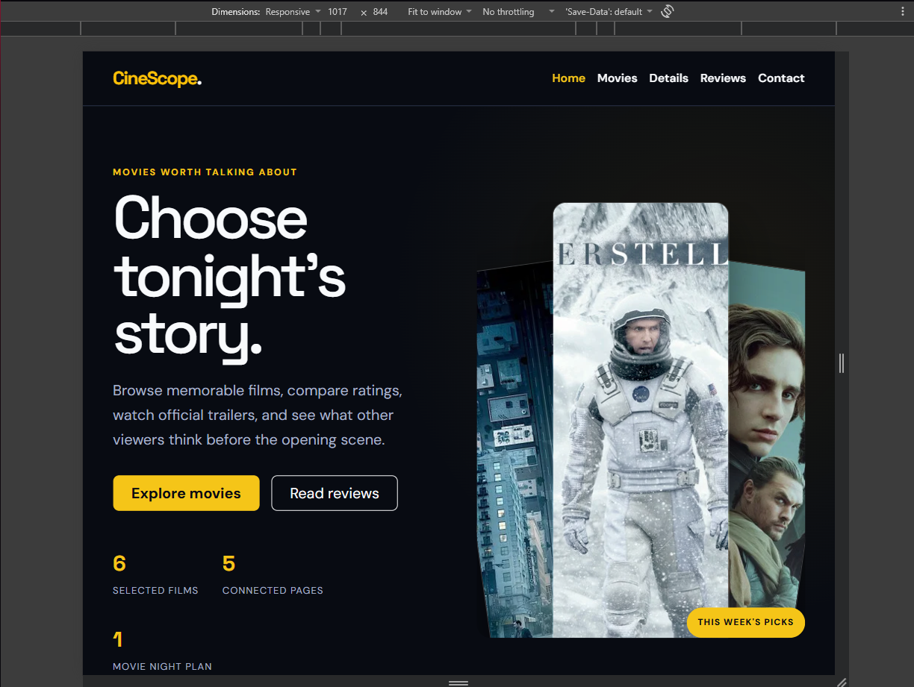

### Movie catalog

Bootstrap columns display three movie cards on a large screen and fewer columns on smaller screens.

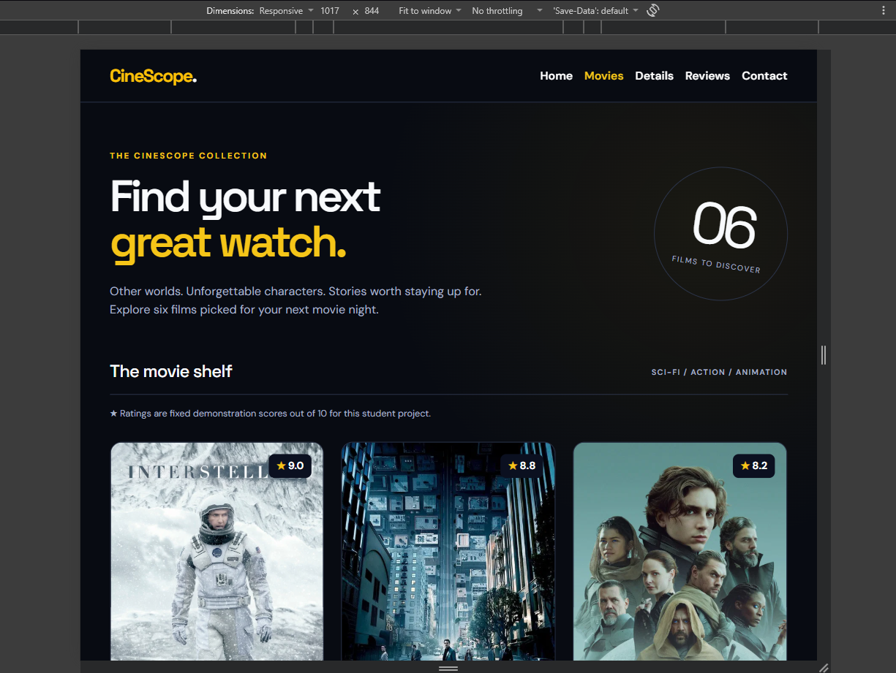

### Movie details and trailer

The details page combines information about each movie with a responsive YouTube trailer.

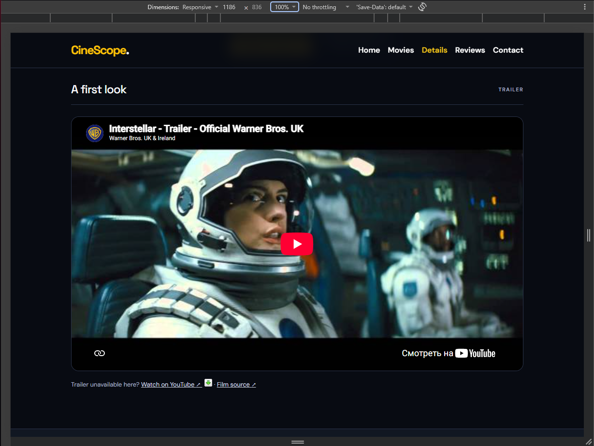

### Ratings and reviews

The reviews page contains a rating table and a form for visitor feedback.

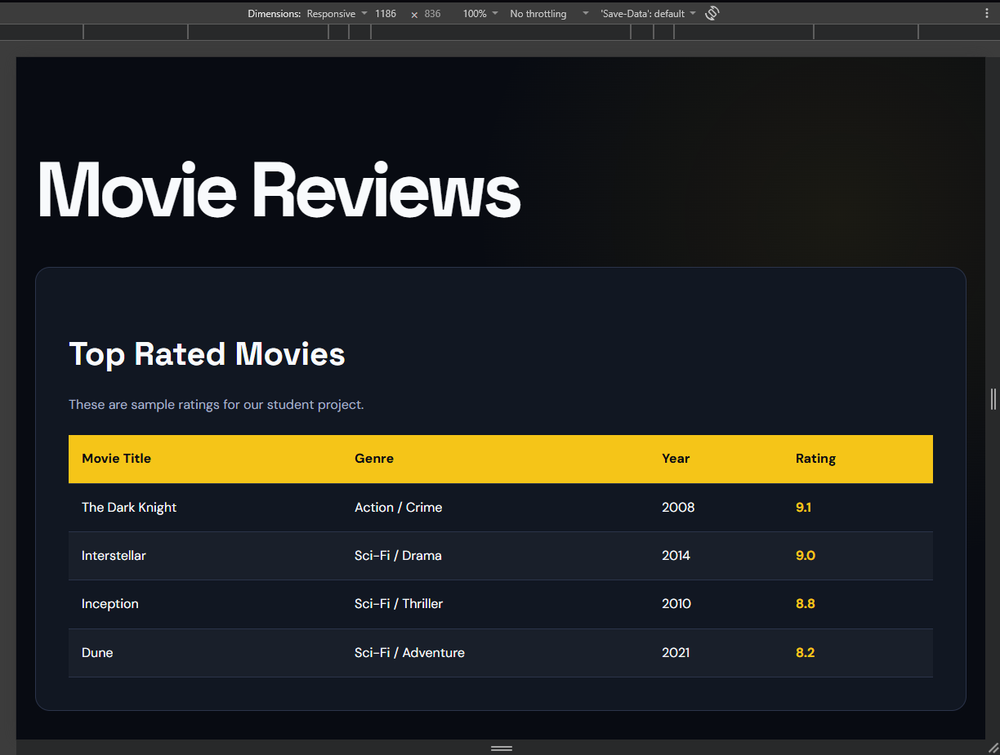

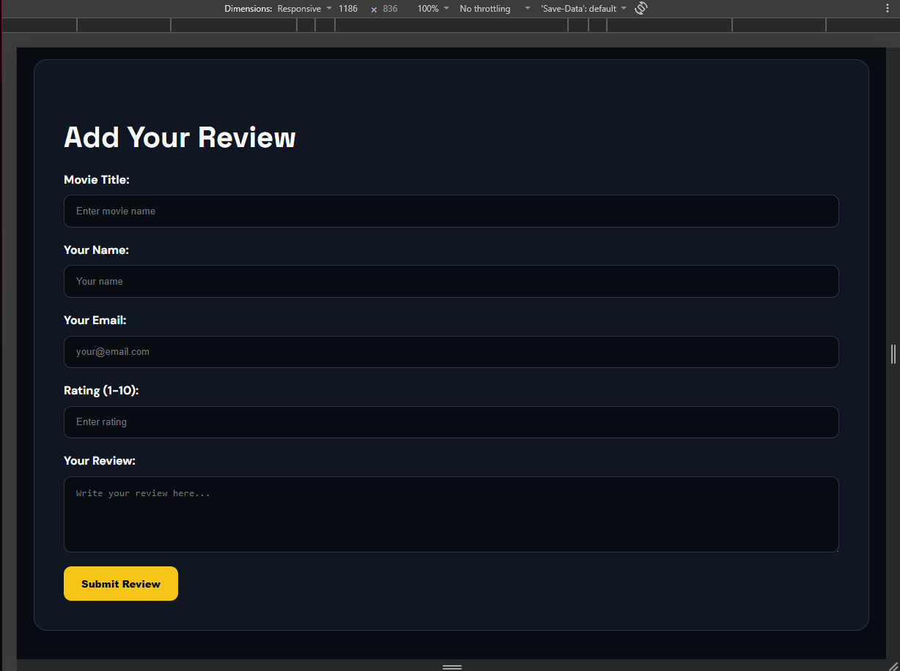

### Mobile layout

On a narrow screen, the team cards and contact content are placed vertically.

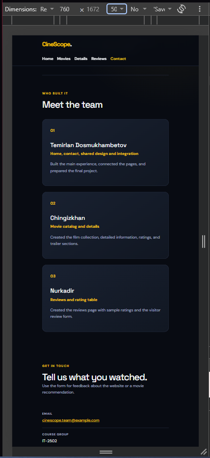

## Code examples

### Bootstrap responsive grid

The Bootstrap column classes change the number of movie cards in each row depending on the screen width.

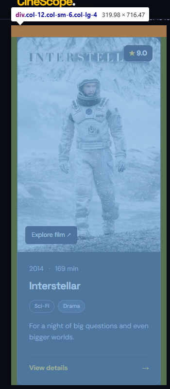

Result:


### CSS Grid

CSS Grid is used for the genre section. A media query changes it to one column on mobile screens.

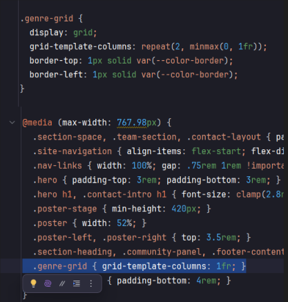

### Flexbox navigation

Flexbox keeps the logo and menu aligned inside the shared navigation bar.

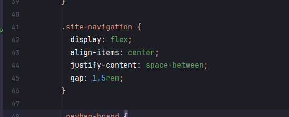

### `:nth-child()` selector

The selector gives every second row in the rating table a different background.

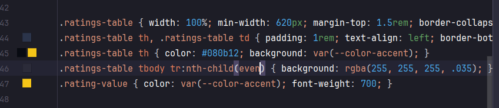

Result:


### Form focus state

The focus rule makes the currently selected form field easier to see.

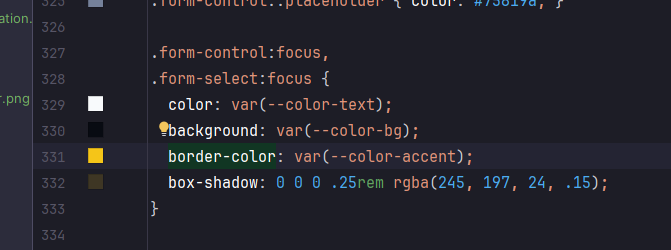

Result:

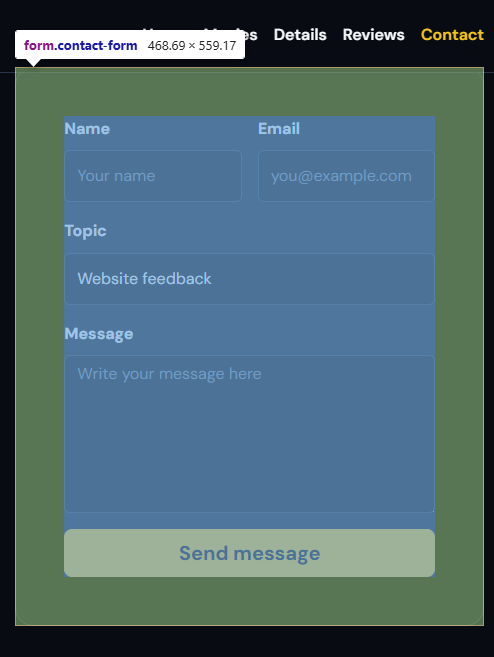

## How to open the project

Clone the repository and open `index.html` in a browser. It can also be opened with the built-in preview in WebStorm.

```bash
git clone https://github.com/TemirlanDosDos/movie-midterm-2026.git
cd movie-midterm-2026
```

## Repository

https://github.com/TemirlanDosDos/movie-midterm-2026
